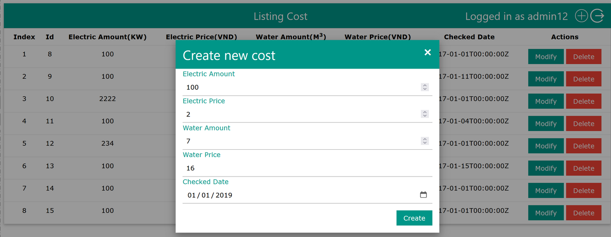
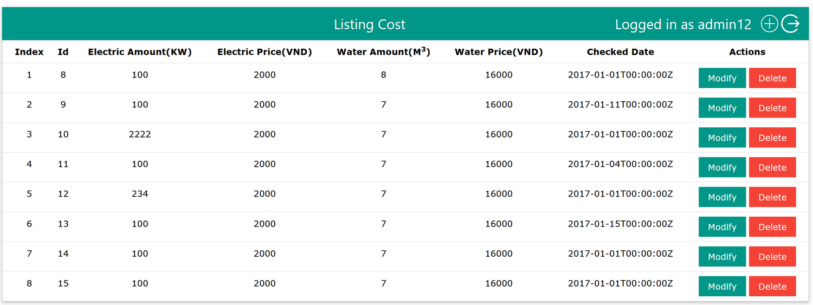

[](https://travis-ci.org/yonush/pwrcost)

# Introduction
This sample aim to demonstrate a basic RESTful API - based off [famcost](https://github.com/thanhngvpt/famcost). It uses mostly built-in Go's packages such as `net/http`, `database/sql`, `strconv`, `html/template` and use a third party packages Gorilla/mux for teh router and jackc/pgx for the PostegreSQL driver

This partial application was created to demonstrate the following:</p>

- Go HTML templates
- RESTful API with gorilla/mux 
- Datastorage using PostgreSQL - tested with 15.4.1
- View a record details and add/edit records 
- No filtering or sorting ahs been implemented

The application is a standalone demo requiring no additional WAMP/LAMP dependencies. It has been built and tested on Windows, standalone Ubuntu Linux and WSL:Ubuntu. If the application requires rebuilding, there are two batch files provided. The rebuild assumes there is an existing Go installation on the host computer. The provided batch files will download the required 3rd party packages for the build process.

## Building
This application uses the Go programming language - where the latest was [Go 1.21](https://go.dev/dl/) as of writing this application. If you do not have Go installed on your system, you can acquire a copy from [Go.dev](https://go.dev/dl/). The go1.21.0.windows-amd64.msi was used to build this application.


### Database configuration
The app assumes a database exists - ESD. Edit the *app.go* to change the default database name. Database defaults in the *app.go* are shown below.

``` go
const (
	host     = "localhost"
	port     = 5432
	user     = "postgres"
	password = "postgres"
	dbname   = "ESD"
)
```
To run the server on your Windows system:

1. Run `buildpkg.cmd` in the *pwrcost* folder to build the binary (`pwrcost.exe`) using non vendored packages
1. Run `buildvendor.cmd` in the *pwrcost* folder to build the binary (`pwrcost.exe`) with the vendor
1. Run the binary `pwrcost.exe` or used the run.cmd (has env variable set)
1. Browse to [http://localhost:8080](http://localhost:8080) to test the application out. If port 80 does not work, you can start the app as follows.

    ``` sh
        > pwrcost 8080
    ```  
### Non Windows
Testing has been performed on WSL & Linux but not MacOS. However, the commands in buildpkg.cmd and buildvendor.cmd can be run manually to build and run this demo.

#### Build by pkg

``` bash
export GO111MODULE="on"
export GOFLAGS="-mod=mod"
go mod download
:: strip debug info during build
go build -ldflags="-s -w" .

``` 
#### Build by vendor

``` bash
export GO111MODULE="on"
export GOFLAGS="-mod=vendor"
go mod vendor
:: strip debug info during build
go build -ldflags="-s -w" 
```

### Dependencies
The application uses the following Go packages to build;

- [Datastore: PostgreSQL driver](https://github.com/jackc/pgx/)
- [HTTP router: Gorilla mux](https://github.com/gorilla/mux)

## Datastore

This version application requires a separate database to function - PostgreSQL. A few CSV files are imported from the local data folder. This will be imported when the application is run for the first time. Thereafter the application will use the database each time it is executed.

## Sample screens



